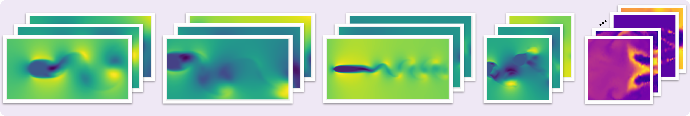

<!-- Hero Section -->
<section class="section rp-fullbleed rp-fullbleed--hero">
  

    <!-- Hero media: synced Real↔Sim comparison carousel (per-dataset) -->
    

      

        

          <!-- Slide: Combustion -->
          

            

              <!-- Left card: Real base, Sim overlay (drag → becomes Sim) -->
              

                <video class="rp-compare-base" muted playsinline loop preload="metadata">
                  <source src="assets/videos/combusion/combusion_real.mp4" type="video/mp4">
                </video>
                
REAL

                

                  <video class="rp-compare-over" muted playsinline loop preload="metadata">
                    <source src="assets/videos/combusion/combusion_sim.mp4" type="video/mp4">
                  </video>
                  
SIM

                

                

              

              <!-- Right card: Sim base, Real overlay (drag → becomes Real) -->
              

                <video class="rp-compare-base" muted playsinline loop preload="metadata">
                  <source src="assets/videos/combusion/combusion_sim.mp4" type="video/mp4">
                </video>
                
SIM

                

                  <video class="rp-compare-over" muted playsinline loop preload="metadata">
                    <source src="assets/videos/combusion/combusion_real.mp4" type="video/mp4">
                  </video>
                  
REAL

                

                

              

            

            

              Combustion
            

          

          <!-- Slide: FSI -->
          

            

              <!-- Left card: Real base, Sim overlay (drag → becomes Sim) -->
              

                <video class="rp-compare-base" muted playsinline loop preload="metadata">
                  <source src="assets/videos/fsi/fsi_real.mp4" type="video/mp4">
                </video>
                
REAL

                

                  <video class="rp-compare-over" muted playsinline loop preload="metadata">
                    <source src="assets/videos/fsi/fsi_sim.mp4" type="video/mp4">
                  </video>
                  
SIM

                

                

              

              <!-- Right card: Sim base, Real overlay (drag → becomes Real) -->
              

                <video class="rp-compare-base" muted playsinline loop preload="metadata">
                  <source src="assets/videos/fsi/fsi_sim.mp4" type="video/mp4">
                </video>
                
SIM

                

                  <video class="rp-compare-over" muted playsinline loop preload="metadata">
                    <source src="assets/videos/fsi/fsi_real.mp4" type="video/mp4">
                  </video>
                  
REAL

                

                

              

            

            

              FSI
            

          

          <!-- Slide: Cylinder -->
          

            

              <!-- Left card: Real base, Sim overlay (drag → becomes Sim) -->
              

                <video class="rp-compare-base" muted playsinline loop preload="metadata">
                  <source src="assets/videos/cylinder/cylinder_real.mp4" type="video/mp4">
                </video>
                
REAL

                

                  <video class="rp-compare-over" muted playsinline loop preload="metadata">
                    <source src="assets/videos/cylinder/cylinder_sim.mp4" type="video/mp4">
                  </video>
                  
SIM

                

                

              

              <!-- Right card: Sim base, Real overlay (drag → becomes Real) -->
              

                <video class="rp-compare-base" muted playsinline loop preload="metadata">
                  <source src="assets/videos/cylinder/cylinder_sim.mp4" type="video/mp4">
                </video>
                
SIM

                

                  <video class="rp-compare-over" muted playsinline loop preload="metadata">
                    <source src="assets/videos/cylinder/cylinder_real.mp4" type="video/mp4">
                  </video>
                  
REAL

                

                

              

            

            

              Cylinder
            

          

          <!-- Slide: Controlled Cylinder -->
          

            

              <!-- Left card: Real base, Sim overlay (drag → becomes Sim) -->
              

                <video class="rp-compare-base" muted playsinline loop preload="metadata">
                  <source src="assets/videos/controlled_cylinder/controlled_cylinder_real.mp4" type="video/mp4">
                </video>
                
REAL

                

                  <video class="rp-compare-over" muted playsinline loop preload="metadata">
                    <source src="assets/videos/controlled_cylinder/controlled_cylinder_sim.mp4" type="video/mp4">
                  </video>
                  
SIM

                

                

              

              <!-- Right card: Sim base, Real overlay (drag → becomes Real) -->
              

                <video class="rp-compare-base" muted playsinline loop preload="metadata">
                  <source src="assets/videos/controlled_cylinder/controlled_cylinder_sim.mp4" type="video/mp4">
                </video>
                
SIM

                

                  <video class="rp-compare-over" muted playsinline loop preload="metadata">
                    <source src="assets/videos/controlled_cylinder/controlled_cylinder_real.mp4" type="video/mp4">
                  </video>
                  
REAL

                

                

              

            

            

              Controlled Cylinder
            

          

          <!-- Slide: Foil -->
          

            

              <!-- Left card: Real base, Sim overlay (drag → becomes Sim) -->
              

                <video class="rp-compare-base" muted playsinline loop preload="metadata">
                  <source src="assets/videos/foil/foil_real.mp4" type="video/mp4">
                </video>
                
REAL

                

                  <video class="rp-compare-over" muted playsinline loop preload="metadata">
                    <source src="assets/videos/foil/foil_sim.mp4" type="video/mp4">
                  </video>
                  
SIM

                

                

              

              <!-- Right card: Sim base, Real overlay (drag → becomes Real) -->
              

                <video class="rp-compare-base" muted playsinline loop preload="metadata">
                  <source src="assets/videos/foil/foil_sim.mp4" type="video/mp4">
                </video>
                
SIM

                

                  <video class="rp-compare-over" muted playsinline loop preload="metadata">
                    <source src="assets/videos/foil/foil_real.mp4" type="video/mp4">
                  </video>
                  
REAL

                

                

              

            

            

              Foil
            

          

        

      

      <button type="button" class="rp-carousel-nav rp-carousel-prev" data-rp-carousel-prev aria-label="Previous dataset"></button>
      <button type="button" class="rp-carousel-nav rp-carousel-next" data-rp-carousel-next aria-label="Next dataset"></button>
      

    

    

      <h1 class="hero-title">
        RealPDEBench: 
        Bridging the Sim-to-Real Gap
      </h1>
      

        The first scientific ML benchmark with <strong style="font-weight: 600;">paired real-world and simulated data</strong> for complex physical systems
      

      

        

          Peiyan Hu*, Haodong Feng*, Yue Wang, Zhiming Ma, Tailin Wu†
        

        
* Equal contribution · † Corresponding author

      

      

        <a href="#datasets" class="btn-primary">Explore Datasets</a>
        <a href="#download" class="btn-secondary">Paper</a>
      

    

  

</section>

<!-- Dataset Visualization -->
<section class="section rp-dataset-showcase">
  

    

      

        
Real-World Experiments

        
      

      

        
CFD Simulations

        
      

    

  

</section>

<!-- Key Stats -->
<section class="section-sm">
  

    

      

        5
        Datasets
      

      

        700+
        Trajectories
      

      

        10
        Baseline Models
      

      

        8
        Evaluation Metrics
      

    

  

</section>

<!-- Bento Grid - Datasets Showcase -->
<section id="datasets" class="section">
  

    
Benchmark Datasets

    <h2 class="section-title">Five Physical Systems Real Experiments + CFD Simulations</h2>

    

      <!-- Large: FSI -->
      <a class="bento-item bento-large glass-card" href="datasets/fsi/" style="background: linear-gradient(135deg, rgba(216,212,230,0.3) 0%, rgba(255,255,255,0.9) 100%); display: flex; align-items: center;">
        

          

            <h3 style="font-size: 2rem; font-weight: 600; margin-bottom: 1rem;">FSI</h3>
            

              Two-way fluid–structure interaction with cylinder vibration (vortex-induced vibration), spanning <strong>Re 3272–9068</strong> across varying mass ratio and damping.
            

            

              Fluid-Structure
              Two-way Coupling
              VIV
            

          

          

            

              <video muted playsinline loop autoplay preload="metadata">
                <source src="assets/videos/fsi/fsi_real.mp4" type="video/mp4">
              </video>
              

                FSI Coupling
              

            

          

        

      </a>

      <!-- Medium: Controlled Cylinder -->
      <a class="bento-item bento-medium glass-card card-lavender" href="datasets/controlled-cylinder/">
        

          

            <video muted playsinline loop autoplay preload="metadata">
              <source src="assets/videos/controlled_cylinder/controlled_cylinder_real.mp4" type="video/mp4">
            </video>
            

              Active Control
            

          

        

        <h3 style="font-size: 1.5rem; font-weight: 600; margin-bottom: 0.75rem;">Controlled Cylinder</h3>
        

          Active control via forced vibration (f 0.5–1.4 Hz, Re 1781–9843).
        

      </a>

      <!-- Medium: Cylinder -->
      <a class="bento-item bento-medium glass-card" href="datasets/cylinder/">
        

          

            <video muted playsinline loop autoplay preload="metadata">
              <source src="assets/videos/cylinder/cylinder_real.mp4" type="video/mp4">
            </video>
            

              Cylinder Wake Dynamics PIV Visualization
            

          

        

        <h3 style="font-size: 1.5rem; font-weight: 600; margin-bottom: 0.75rem;">Cylinder</h3>
        

          Stationary cylinder wake (Re 1800–12000) measured by PIV.
        

      </a>

      <!-- Medium: Foil -->
      <a class="bento-item bento-small glass-card" href="datasets/foil/">
        

          

            <video muted playsinline loop autoplay preload="metadata">
              <source src="assets/videos/foil/foil_real.mp4" type="video/mp4">
            </video>
            

              NACA0025 Foil
            

          

        

        <h3 style="font-size: 1.5rem; font-weight: 600; margin-bottom: 0.75rem;">Foil</h3>
        

          NACA0025 airfoil: 2D slices of 3D flow (AoA 0°–20°, Re 2968–17031).
        

      </a>

      <!-- Wide: Combustion -->
      <a class="bento-item bento-wide glass-card" href="datasets/combustion/" style="background: linear-gradient(90deg, var(--platinum) 0%, var(--lavender-light) 100%);">
        

          

            <h3 style="font-size: 2rem; font-weight: 600; margin-bottom: 1rem;">Combustion</h3>
            

              3D swirl-stabilized NH₃/CH₄/air flames captured with OH* chemiluminescence at <strong>4000 fps</strong>. Large Eddy Simulation with 38 species and 184 reactions.
            

            

              Combustion
              3D LES
              Multi-physics
            

          

          

            

              <video muted playsinline loop autoplay preload="metadata">
                <source src="assets/videos/combusion/combusion_real.mp4" type="video/mp4">
              </video>
              

                Flame OH* Chemiluminescence 4000 FPS High-Speed Imaging
              

            

          

        

      </a>

    

  

</section>

<!-- Core Problem Section -->
<section id="challenge" class="section rp-challenge-section">
  

    

      
The Challenge

      <h2 class="section-title">Why Real-World Data Matters</h2>
      

        Most scientific ML models are only validated on simulated data, creating a <strong>critical gap</strong> between theory and practice.
      

    

    

      

        <h3 class="rp-challenge-title">Numerical Errors</h3>
        
Discretization and modeling assumptions in CFD simulations

      

      

        <h3 class="rp-challenge-title">Measurement Noise</h3>
        
Camera sensors and particle tracking introduce real-world noise

      

      

        <h3 class="rp-challenge-title">Unmeasured Modalities</h3>
        
Pressure fields and 3D velocities cannot be fully measured

      

    

  

</section>

<!-- Key Findings -->
<section class="section">
  

    
Research Findings

    <h2 class="section-title">Significant Sim-to-Real Gap</h2>

    

      

        

          
9-79%

          <h4 style="font-size: 1.25rem; font-weight: 600; margin-bottom: 1rem;">Performance Improvement</h4>
          
Real-world training achieves 9.39% to 78.91% better accuracy than simulated-only training

        

      

      

        

          
3

          <h4 style="font-size: 1.25rem; font-weight: 600; margin-bottom: 1rem;">Training Paradigms</h4>
          
Simulated training, real-world training, and sim-pretrain + real-finetune evaluated

        

      

      

        

          
&lt; 1.0

          <h4 style="font-size: 1.25rem; font-weight: 600; margin-bottom: 1rem;">Update Ratio</h4>
          
Pretraining on simulated data accelerates convergence on real-world data

        

      

    

  

</section>

<!-- Baseline Models -->
<section id="baseline-models" class="section rp-fullbleed rp-fullbleed--platinum">
  

    
Benchmark

    <h2 class="section-title">10 Baseline Models Evaluated</h2>

    

      

        <h4 style="font-weight: 600; margin-bottom: 0.5rem; color: var(--slate); font-size: 0.875rem;">FOUNDATION MODELS</h4>
        <ul style="list-style: none; padding: 0; margin: 0;">
          <li style="padding: 0.5rem 0; border-bottom: 1px solid var(--lavender-light);">DPOT-L (509M params)</li>
          <li style="padding: 0.5rem 0;">DPOT-S (30M params)</li>
        </ul>
      

      

        <h4 style="font-weight: 600; margin-bottom: 0.5rem; color: var(--slate); font-size: 0.875rem;">NEURAL OPERATORS</h4>
        <ul style="list-style: none; padding: 0; margin: 0;">
          <li style="padding: 0.5rem 0; border-bottom: 1px solid var(--lavender-light);">FNO</li>
          <li style="padding: 0.5rem 0; border-bottom: 1px solid var(--lavender-light);">CNO</li>
          <li style="padding: 0.5rem 0; border-bottom: 1px solid var(--lavender-light);">DeepONet</li>
          <li style="padding: 0.5rem 0;">MWT, GK-Transformer, Transolver, WDNO</li>
        </ul>
      

      

        <h4 style="font-weight: 600; margin-bottom: 0.5rem; color: var(--slate); font-size: 0.875rem;">TRADITIONAL & CNN</h4>
        <ul style="list-style: none; padding: 0; margin: 0;">
          <li style="padding: 0.5rem 0; border-bottom: 1px solid var(--lavender-light);">DMD</li>
          <li style="padding: 0.5rem 0;">U-Net</li>
        </ul>
      

    

  

</section>

<!-- Evaluation Metrics -->
<section id="evaluation-metrics" class="section">
  

    
Comprehensive Evaluation

    <h2 class="section-title">8 Evaluation Metrics</h2>
    

      Both data-oriented and physics-oriented metrics provide comprehensive model assessment
    

    

      

        

          <h3 style="font-size: 1.5rem; font-weight: 600; margin-bottom: 1.5rem;">Data-Oriented</h3>
          <ul class="rp-metrics-list" aria-label="Data-oriented metrics (hover for definitions)">
            <li class="rp-metric-item" data-desc="Root Mean Square Error">
              RMSE
            </li>
            <li class="rp-metric-item" data-desc="Mean Absolute Error">
              MAE
            </li>
            <li class="rp-metric-item" data-desc="Relative L₂ Error">
              Rel L₂
            </li>
            <li class="rp-metric-item" data-desc="Coefficient of Determination">
              R²
            </li>
          </ul>
        

      

      

        

          <h3 style="font-size: 1.5rem; font-weight: 600; margin-bottom: 1.5rem;">Physics-Oriented</h3>
          <ul class="rp-metrics-list" aria-label="Physics-oriented metrics (hover for definitions)">
            <li class="rp-metric-item" data-desc="Fourier Space Error">
              fRMSE
            </li>
            <li class="rp-metric-item" data-desc="Frequency Error (Periodicity)">
              FE
            </li>
            <li class="rp-metric-item" data-desc="Kinetic Energy Error">
              KE
            </li>
            <li class="rp-metric-item" data-desc="Mean Velocity Profile Error">
              MVPE
            </li>
          </ul>
        

      

    

  

</section>

<!-- CTA Section -->
<section id="download" class="section rp-fullbleed rp-fullbleed--download">
  

    

    

  

  

    
Resources

    <h2 class="section-title">Data, Code, and Reproducibility</h2>
    

      Access datasets, baselines, and evaluation scripts to reproduce results and benchmark new models on paired experiments and CFD simulations.
    

    

      <a href="getting-started/" class="btn-primary" style="font-size: 1.05rem; padding: 14px 32px;">
        Getting Started
      </a>
      <a href="datasets/" class="btn-secondary" style="font-size: 1.05rem; padding: 14px 28px; background: rgba(255,255,255,0.92);">
        Browse Datasets
      </a>
      <a href="https://github.com/realpdebench/realpdebench.github.io" class="btn-secondary" style="font-size: 1.05rem; padding: 14px 28px; background: rgba(255,255,255,0.92);">
        Code & Baselines
      </a>
    

    <!-- Inline Citation (BibTeX) -->
    

      

        Citation
      

      
If you find RealPDEBench useful in your research, please cite:

      

        BibTeX
      

      <pre class="rp-code-block"><code class="language-plaintext">@article{realpdebench2025,
  title={RealPDEBench: A Benchmark for Complex Physical Systems with Real-World Data},
  author={Authors},
  year={2025}
}</code></pre>
    

  

</section>
