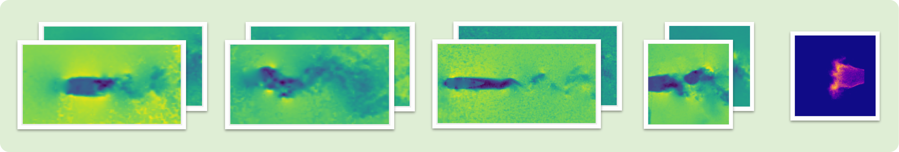
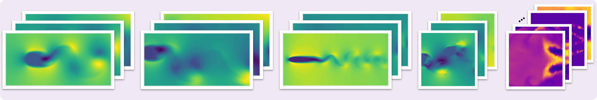

<!-- Hero Section -->
<section class="section rp-fullbleed rp-fullbleed--hero">
  

    <!-- Hero media: synced Real↔Sim comparison carousel (per-dataset) -->
    

      

        

          <!-- Slide: Combustion -->
          

            

              <!-- Left card: Real base, Sim overlay (drag → becomes Sim) -->
              

                <video class="rp-compare-base" muted playsinline loop preload="metadata">
                  <source src="assets/videos/combusion/combusion_real.mp4" type="video/mp4">
                </video>
                
REAL

                

                  <video class="rp-compare-over" muted playsinline loop preload="metadata">
                    <source src="assets/videos/combusion/combusion_sim.mp4" type="video/mp4">
                  </video>
                  
SIM

                

                

              

              <!-- Right card: Sim base, Real overlay (drag → becomes Real) -->
              

                <video class="rp-compare-base" muted playsinline loop preload="metadata">
                  <source src="assets/videos/combusion/combusion_sim.mp4" type="video/mp4">
                </video>
                
SIM

                

                  <video class="rp-compare-over" muted playsinline loop preload="metadata">
                    <source src="assets/videos/combusion/combusion_real.mp4" type="video/mp4">
                  </video>
                  
REAL

                

                

              

            

            

              Combustion
            

          

          <!-- Slide: FSI -->
          

            

              <!-- Left card: Real base, Sim overlay (drag → becomes Sim) -->
              

                <video class="rp-compare-base" muted playsinline loop preload="metadata">
                  <source src="assets/videos/fsi/fsi_real.mp4" type="video/mp4">
                </video>
                
REAL

                

                  <video class="rp-compare-over" muted playsinline loop preload="metadata">
                    <source src="assets/videos/fsi/fsi_sim.mp4" type="video/mp4">
                  </video>
                  
SIM

                

                

              

              <!-- Right card: Sim base, Real overlay (drag → becomes Real) -->
              

                <video class="rp-compare-base" muted playsinline loop preload="metadata">
                  <source src="assets/videos/fsi/fsi_sim.mp4" type="video/mp4">
                </video>
                
SIM

                

                  <video class="rp-compare-over" muted playsinline loop preload="metadata">
                    <source src="assets/videos/fsi/fsi_real.mp4" type="video/mp4">
                  </video>
                  
REAL

                

                

              

            

            

              FSI
            

          

          <!-- Slide: Cylinder -->
          

            

              <!-- Left card: Real base, Sim overlay (drag → becomes Sim) -->
              

                <video class="rp-compare-base" muted playsinline loop preload="metadata">
                  <source src="assets/videos/cylinder/cylinder_real.mp4" type="video/mp4">
                </video>
                
REAL

                

                  <video class="rp-compare-over" muted playsinline loop preload="metadata">
                    <source src="assets/videos/cylinder/cylinder_sim.mp4" type="video/mp4">
                  </video>
                  
SIM

                

                

              

              <!-- Right card: Sim base, Real overlay (drag → becomes Real) -->
              

                <video class="rp-compare-base" muted playsinline loop preload="metadata">
                  <source src="assets/videos/cylinder/cylinder_sim.mp4" type="video/mp4">
                </video>
                
SIM

                

                  <video class="rp-compare-over" muted playsinline loop preload="metadata">
                    <source src="assets/videos/cylinder/cylinder_real.mp4" type="video/mp4">
                  </video>
                  
REAL

                

                

              

            

            

              Cylinder
            

          

          <!-- Slide: Controlled Cylinder -->
          

            

              <!-- Left card: Real base, Sim overlay (drag → becomes Sim) -->
              

                <video class="rp-compare-base" muted playsinline loop preload="metadata">
                  <source src="assets/videos/controlled_cylinder/controlled_cylinder_real.mp4" type="video/mp4">
                </video>
                
REAL

                

                  <video class="rp-compare-over" muted playsinline loop preload="metadata">
                    <source src="assets/videos/controlled_cylinder/controlled_cylinder_sim.mp4" type="video/mp4">
                  </video>
                  
SIM

                

                

              

              <!-- Right card: Sim base, Real overlay (drag → becomes Real) -->
              

                <video class="rp-compare-base" muted playsinline loop preload="metadata">
                  <source src="assets/videos/controlled_cylinder/controlled_cylinder_sim.mp4" type="video/mp4">
                </video>
                
SIM

                

                  <video class="rp-compare-over" muted playsinline loop preload="metadata">
                    <source src="assets/videos/controlled_cylinder/controlled_cylinder_real.mp4" type="video/mp4">
                  </video>
                  
REAL

                

                

              

            

            

              Controlled Cylinder
            

          

          <!-- Slide: Foil -->
          

            

              <!-- Left card: Real base, Sim overlay (drag → becomes Sim) -->
              

                <video class="rp-compare-base" muted playsinline loop preload="metadata">
                  <source src="assets/videos/foil/foil_real.mp4" type="video/mp4">
                </video>
                
REAL

                

                  <video class="rp-compare-over" muted playsinline loop preload="metadata">
                    <source src="assets/videos/foil/foil_sim.mp4" type="video/mp4">
                  </video>
                  
SIM

                

                

              

              <!-- Right card: Sim base, Real overlay (drag → becomes Real) -->
              

                <video class="rp-compare-base" muted playsinline loop preload="metadata">
                  <source src="assets/videos/foil/foil_sim.mp4" type="video/mp4">
                </video>
                
SIM

                

                  <video class="rp-compare-over" muted playsinline loop preload="metadata">
                    <source src="assets/videos/foil/foil_real.mp4" type="video/mp4">
                  </video>
                  
REAL

                

                

              

            

            

              Foil
            

          

        

      

      <button type="button" class="rp-carousel-nav rp-carousel-prev" data-rp-carousel-prev aria-label="Previous dataset"></button>
      <button type="button" class="rp-carousel-nav rp-carousel-next" data-rp-carousel-next aria-label="Next dataset"></button>
      

    

    

      <h1 class="hero-title">
        RealPDEBench: 
        Bridging the Sim-to-Real Gap
      </h1>
      

        The first scientific ML benchmark with <strong style="font-weight: 600;">paired real-world and simulated data</strong> for complex physical systems
      

      

        

          AI for Scientific Simulation and Discovery Lab, Westlake University
        

        
Corresponding author: Tailin Wu

      

      

        <a href="#datasets" class="btn-primary">Explore Datasets</a>
        <a href="#download" class="btn-secondary">Paper</a>
        <a href="https://huggingface.co/datasets/AI4Science-WestlakeU/RealPDEBench" class="btn-secondary" target="_blank" rel="noopener noreferrer">Hugging Face</a>
      

    

  

</section>

<!-- Key Stats -->
<section class="section-sm">
  

    

      

        5
        Datasets
      

      

        700+
        Trajectories
      

      

        10
        Baseline Models
      

      

        8
        Evaluation Metrics
      

    

  

</section>

<!-- Dataset Visualization -->
<section class="section rp-dataset-showcase">
  

    

      

        
Real-World Experiments

        
      

      

        
CFD Simulations

        
      

    

  

</section>

<!-- Core Problem Section -->
<section id="challenge" class="section rp-challenge-section">
  

    

      
The Challenge

      <h2 class="section-title">Why Real-World Data Matters</h2>
      

        Most scientific ML models are only validated on simulated data, creating a <strong>critical gap</strong> between theory and practice.
      

    

    

      

        <h3 class="rp-challenge-title">Numerical Errors</h3>
        
Discretization and modeling assumptions in CFD simulations

      

      

        <h3 class="rp-challenge-title">Measurement Noise</h3>
        
Camera sensors and particle tracking introduce real-world noise

      

      

        <h3 class="rp-challenge-title">Unmeasured Modalities</h3>
        
Pressure fields and 3D velocities cannot be fully measured

      

    

  

</section>

<!-- Bento Grid - Datasets Showcase -->
<section id="datasets" class="section">
  

    
Benchmark Datasets

    <h2 class="section-title">Five Physical Systems Real Experiments + CFD Simulations</h2>
    
Click a dataset card to open the scenario page (data format, downloads, and examples).

    

      <!-- Large: FSI -->
      <a class="bento-item bento-large glass-card" href="datasets/fsi/" style="background: linear-gradient(135deg, rgba(216,212,230,0.3) 0%, rgba(255,255,255,0.9) 100%); display: flex; align-items: center;">
        

          

            <h3 style="font-size: 2rem; font-weight: 600; margin-bottom: 1rem;">FSI</h3>
            

              Two-way fluid–structure interaction with cylinder vibration (vortex-induced vibration), spanning <strong>Re 3272–9068</strong> across varying mass ratio and damping.
            

            

              Fluid-Structure
              Two-way Coupling
              VIV
            

          

          

            

              <video muted playsinline loop autoplay preload="metadata">
                <source src="assets/videos/fsi/fsi_real.mp4" type="video/mp4">
              </video>
              

                FSI Coupling
              

            

          

        

      </a>

      <!-- Medium: Controlled Cylinder -->
      <a class="bento-item bento-medium glass-card card-lavender" href="datasets/controlled-cylinder/">
        

          

            <video muted playsinline loop autoplay preload="metadata">
              <source src="assets/videos/controlled_cylinder/controlled_cylinder_real.mp4" type="video/mp4">
            </video>
            

              Active Control
            

          

        

        <h3 style="font-size: 1.5rem; font-weight: 600; margin-bottom: 0.75rem;">Controlled Cylinder</h3>
        

          Active control via forced vibration (f 0.5–1.4 Hz, Re 1781–9843).
        

      </a>

      <!-- Medium: Cylinder -->
      <a class="bento-item bento-medium glass-card" href="datasets/cylinder/">
        

          

            <video muted playsinline loop autoplay preload="metadata">
              <source src="assets/videos/cylinder/cylinder_real.mp4" type="video/mp4">
            </video>
            

              Cylinder Wake Dynamics PIV Visualization
            

          

        

        <h3 style="font-size: 1.5rem; font-weight: 600; margin-bottom: 0.75rem;">Cylinder</h3>
        

          Stationary cylinder wake (Re 1800–12000) measured by PIV.
        

      </a>

      <!-- Medium: Foil -->
      <a class="bento-item bento-small glass-card" href="datasets/foil/">
        

          

            <video muted playsinline loop autoplay preload="metadata">
              <source src="assets/videos/foil/foil_real.mp4" type="video/mp4">
            </video>
            

              NACA0025 Foil
            

          

        

        <h3 style="font-size: 1.5rem; font-weight: 600; margin-bottom: 0.75rem;">Foil</h3>
        

          NACA0025 airfoil: 2D slices of 3D flow (AoA 0°–20°, Re 2968–17031).
        

      </a>

      <!-- Wide: Combustion -->
      <a class="bento-item bento-wide glass-card" href="datasets/combustion/" style="background: linear-gradient(90deg, var(--platinum) 0%, var(--lavender-light) 100%);">
        

          

            <h3 style="font-size: 2rem; font-weight: 600; margin-bottom: 1rem;">Combustion</h3>
            

              3D swirl-stabilized NH₃/CH₄/air flames captured with OH* chemiluminescence at <strong>4000 fps</strong>. Large Eddy Simulation with 38 species and 184 reactions.
            

            

              Combustion
              3D LES
              Multi-physics
            

          

          

            

              <video muted playsinline loop autoplay preload="metadata">
                <source src="assets/videos/combusion/combusion_real.mp4" type="video/mp4">
              </video>
              

                Flame OH* Chemiluminescence 4000 FPS High-Speed Imaging
              

            

          

        

      </a>

    

  

</section>

<!-- Benchmark Overview (Baselines + Metrics) -->
<section id="benchmark" class="section section-sm">
  

    
Benchmark

    <h2 class="section-title">Baselines & Evaluation</h2>
    
Click a model or metric to open its detail page.

    

      

        <h3 class="rp-overview-heading">10 Baseline Models</h3>

        

          

            
Foundation Models

            <ul class="rp-overview-list">
              <li><a class="rp-overview-link" href="models/dpot/#variants-in-realpdebench">DPOT-L (509M)</a></li>
              <li><a class="rp-overview-link" href="models/dpot/#variants-in-realpdebench">DPOT-S (30M)</a></li>
            </ul>
          

          

            
Traditional & CNN

            <ul class="rp-overview-list">
              <li><a class="rp-overview-link" href="models/dmd/">DMD</a></li>
              <li><a class="rp-overview-link" href="models/unet/">U-Net</a></li>
            </ul>
          

          

            
Neural Operators

            <ul class="rp-overview-list">
              <li><a class="rp-overview-link" href="models/fno/">FNO</a></li>
              <li><a class="rp-overview-link" href="models/cno/">CNO</a></li>
              <li><a class="rp-overview-link" href="models/deeponet/">DeepONet</a></li>
              <li><a class="rp-overview-link" href="models/mwt/">MWT</a></li>
              <li><a class="rp-overview-link" href="models/gk-transformer/">GK-Transformer</a></li>
              <li><a class="rp-overview-link" href="models/transolver/">Transolver</a></li>
              <li><a class="rp-overview-link" href="models/wdno/">WDNO</a></li>
            </ul>
          

        

      

      

        <h3 class="rp-overview-heading">8 Evaluation Metrics</h3>

        

          

            
Data-oriented

            <ul class="rp-metrics-list" aria-label="Data-oriented metrics (hover for definitions)">
              <li class="rp-metric-item" data-desc="Root Mean Square Error">
                <a class="rp-metric-link" href="metrics/data-oriented/#rmse">RMSE</a>
              </li>
              <li class="rp-metric-item" data-desc="Mean Absolute Error">
                <a class="rp-metric-link" href="metrics/data-oriented/#mae">MAE</a>
              </li>
              <li class="rp-metric-item" data-desc="Relative L₂ Error">
                <a class="rp-metric-link" href="metrics/data-oriented/#rel-l2">Rel L₂</a>
              </li>
              <li class="rp-metric-item" data-desc="Coefficient of Determination">
                <a class="rp-metric-link" href="metrics/data-oriented/#r2">R²</a>
              </li>
            </ul>
          

          

            
Physics-oriented

            <ul class="rp-metrics-list" aria-label="Physics-oriented metrics (hover for definitions)">
              <li class="rp-metric-item" data-desc="Fourier Space Error">
                <a class="rp-metric-link" href="metrics/physics-oriented/#frmse">fRMSE</a>
              </li>
              <li class="rp-metric-item" data-desc="Frequency Error (Periodicity)">
                <a class="rp-metric-link" href="metrics/physics-oriented/#fe">FE</a>
              </li>
              <li class="rp-metric-item" data-desc="Kinetic Energy Error">
                <a class="rp-metric-link" href="metrics/physics-oriented/#ke">KE</a>
              </li>
              <li class="rp-metric-item" data-desc="Mean Velocity Profile Error">
                <a class="rp-metric-link" href="metrics/physics-oriented/#mvpe">MVPE</a>
              </li>
            </ul>
          

        

      

    

  

</section>

<!-- Benchmark Results -->
<section id="benchmark-results" class="section rp-fullbleed rp-fullbleed--platinum">
  

    
Results Explorer

    <h2 class="section-title">Explore Results</h2>
    

      Baseline ranking on real-world test data, stratified by dataset and training paradigm.
    

    

      

        
SINGLE-METRIC COMPARISON

        
Bar Chart

        

          Bars are sorted best → worst (longest → shortest) for the selected metric.
          <strong>Bar length is min–max normalized across all models in the current dataset + training paradigm</strong>
          (best = 100% / full bar; worst = 0%).
          <strong>
            For error metrics (↓), smaller raw values correspond to longer bars; for R² (↑), larger values correspond to longer bars.
          </strong>
        

      

      

        

          <label class="rp-benchmark-label" for="rp-benchmark-dataset">Dataset</label>
          <select id="rp-benchmark-dataset" class="rp-select" aria-label="Dataset"></select>
        

        

          Training paradigm
          

            <button type="button" class="rp-seg-btn is-active" data-paradigm="simulated_training" aria-checked="true" role="radio" title="Trained on simulated (numerical/CFD) data; evaluated on real-world test data.">Simulated training</button>
            <button type="button" class="rp-seg-btn" data-paradigm="real_training" aria-checked="false" role="radio" title="Trained on real-world data; evaluated on real-world test data.">Real-world training</button>
            <button type="button" class="rp-seg-btn" data-paradigm="real_finetuning" aria-checked="false" role="radio" title="Simulated pretraining, then real-world finetuning; evaluated on real-world test data.">Real-world finetuning</button>
          

        

        

          <label class="rp-benchmark-label" for="rp-benchmark-metric">Metric</label>
          <select id="rp-benchmark-metric" class="rp-select" aria-label="Metric">
            <option value="rmse">RMSE (↓)</option>
            <option value="mae">MAE (↓)</option>
            <option value="rel_l2">Rel L₂ (↓)</option>
            <option value="r2">R² (↑)</option>
            <option value="frmse">fRMSE (↓)</option>
            <option value="fe">FE (↓)</option>
            <option value="ke">KE (↓)</option>
            <option value="mvpe">MVPE (↓)</option>
          </select>
        

        

          <label class="rp-benchmark-label" for="rp-benchmark-topk">Show</label>
          <select id="rp-benchmark-topk" class="rp-select" aria-label="How many models to show">
            <option value="5">Top 5</option>
            <option value="999">All</option>
          </select>
        

      

      

        

          

            Training paradigm
            Simulated training
          

          

            trained on simulated (numerical/CFD) data.
          

        

        

          Metric
          RMSE
          —
          Root Mean Square Error
          (↓ lower is better)
        

        

          Pointwise error between predicted and ground-truth fields.
        

      

      

        
Loading benchmark data…

      

      

      <!-- Multi-metric radar comparison -->
      

        

          

            
Multi-metric comparison

            
Radar chart across performance dimensions

            

              Scores are min–max normalized to <strong>0–100</strong> within the current dataset + training paradigm.
              Use <strong>Zoom</strong> to normalize within the currently selected models for clearer separation.
              <strong>Higher is better</strong>. Axes are computed from the reported benchmark metrics (no extra measurements).
            

          

        

        

        

          

          

            

              <button type="button" class="rp-chip-btn" data-rp-radar-top5>Top 5</button>
              <button type="button" class="rp-chip-btn" data-rp-radar-all>All models</button>
              <button type="button" class="rp-chip-btn" data-rp-radar-clear>Clear</button>
              <button
                type="button"
                class="rp-chip-btn"
                data-rp-radar-zoom
                aria-pressed="false"
                title="Zoom: normalize axes within the selected models (better separation; not comparable across different selections)."
              >
                Zoom
              </button>
            

            

          

        

      

      

        Notes:
        Reported metrics are evaluated on real-world test data. DMD has no training stage; where unavailable, values are omitted.
      

    

  

</section>

<!-- Key Takeaways -->
<section class="section">
  

    
Key Takeaways

    <h2 class="section-title">Key Findings</h2>

    

      

        

          1
          Real data and simulation fail in different ways.
          
        

        

          Real-world measurements are dominated by sensor and measurement noise, while simulated data are dominated by numerical and modeling error (e.g., discretization, LES closures, idealized conditions).
          That mismatch changes the error distribution—and is a key reason sim-to-real transfer is hard.
        

      

      

        

          2
          Simulation is cheap and information-rich, but imperfect.
          
        

        

          Simulated data are cheaper to generate at scale, can expose additional modalities (e.g., pressure), and avoid measurement-induced noise.
          This makes simulation valuable for coverage and pretraining, even though it cannot perfectly match reality.
        

      

      

        

          3
          Simulation-only training doesn't transfer cleanly to real tests.
          
        

        

          Across datasets, models trained on simulated trajectories show a clear performance gap when evaluated on real-world measurements.
          Even when physical parameters are matched, learning only from simulation tends to miss real-world effects.
        

      

      

        

          4
          Training on real data closes much of the gap.
          
        

        

          On real-world benchmarks, training directly on real measurements yields substantially lower errors than training on simulated data only.
          In our main results, real-world training improves Rel \(L_2\) by <strong>9.39% to 78.91%</strong> (depending on dataset and model).
        

      

      

        

          5
          Pretrain on simulation, finetune on real: best of both.
          
        

        

          Simulated pretraining followed by real-world finetuning often outperforms training on real-world data from scratch with the same real-data budget.
          Pretraining helps models pick up broad dynamics from large simulated corpora, then adapt to real measurement artifacts during finetuning.
        

      

      

        

          6
          Pretraining saves updates.
          
        

        

          Finetuned models reach the same (or better) performance with fewer real-data update steps—reflected by Update Ratios below one for most settings.
          On Combustion, the validation RMSE curve drops faster under finetuning than training from scratch.
        

      

      

        

          7
          Architectures trade off pointwise accuracy vs. global structure.
          
        

        

          Convolution-based models (e.g., U-Net, CNO) tend to do well on pointwise errors like RMSE.
          Models with operator / wavelet structure (e.g., MWT) can better preserve periodicity and other global features—so "best model" depends on the metric you care about.
        

      

      

        

          8
          Long-horizon rollouts separate short-term wins from stable dynamics.
          
        

        

          Autoregressive evaluation makes error accumulation obvious: a model that looks great at one-step prediction can drift quickly over multiple rollouts.
          In our Cylinder long-horizon analysis, the large pretrained DPOT model is among the most stable under multi-round evaluation.
        

      

    

  

</section>

<!-- CTA Section -->
<section id="download" class="section rp-fullbleed rp-fullbleed--download">
  

    

    

  

  

    
Resources

    <h2 class="section-title">Reproducibility</h2>
    

      Access datasets, baselines, and evaluation scripts to reproduce results and benchmark new models on paired experiments and CFD simulations.
    

    

      <a href="getting-started/" class="btn-primary" style="font-size: 1.05rem; padding: 14px 32px;">
        Getting Started
      </a>
      <a href="https://github.com/AI4Science-WestlakeU/RealPDEBench" class="btn-secondary" style="font-size: 1.05rem; padding: 14px 28px; background: rgba(255,255,255,0.92);">
        Code & Baselines
      </a>
    

    <!-- Inline Citation (BibTeX) -->
    

      

        Citation
      

      
If you find RealPDEBench useful in your research, please cite:

      

        BibTeX
      

      <pre class="rp-code-block"><code class="language-plaintext">@article{realpdebench2025,
  title={RealPDEBench: A Benchmark for Complex Physical Systems with Real-World Data},
  author={Authors},
  year={2025}
}</code></pre>
    

  

</section>
